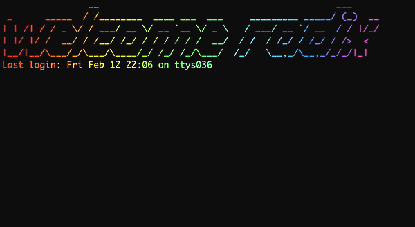

# RGB ASCII art tools

This is my first go with Python :)

It consists of a couple of small python scripts:

### colorize_ascii

This can be ran by specifying an `input file` or a `text string` to generate an ASCII banner.

It will also take a few other parameters in order to configure the result:
```
  -i file     input file
  -t text     text to generate
  -f font     font to use, check them here: http://www.figlet.org/examples.html
  -c colors   comma separated hex colors (for example: FF0000,00FF00,0000FF)
  -s spin     number of columns which colors will rotate on next line
  -o file     output file
  -w width    max width of the banner
```


### welcome_message

This one prints a colorful welcome message on your terminal.

Just add it to your shell config (i.e. `.zshrc`, `.bash_profile`, etc).

It also accepts a few config parameters:
```
  -u user     override system username
  -m message  custom message (default will be "welcome user")
  -l          hide last login
  -f font     font to use, check them here: http://www.figlet.org/examples.html
  -c colors   comma separated hex colors (for example: FF0000,00FF00,0000FF)
  -s spin     number of columns which colors will rotate on next line
  -a times    animate n times
  -w width    max width of the banner
```



### Dependencies

You'll need `pyfiglet` and you can install it like this:

```
pip3 install pyfiglet
```


