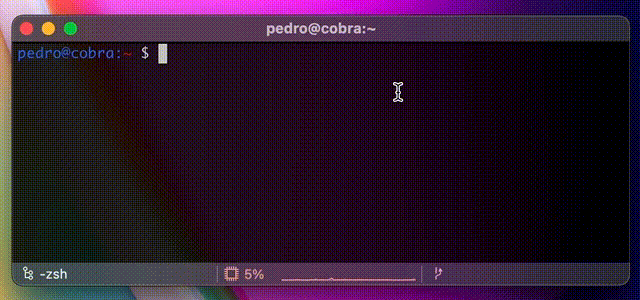

# rgb-ascii-art

This is part of my learning process with Python :)

Initially created `HexToAnsiColors.py` to convert na hex color coded ascii banner created with http://patorjk.com/software/taag/ and coloured with http://patorjk.com/text-color-fader/, the output will be something you can colorfully print in you terminal.

Then I decided to go with my own color transition algorithm so I created `ColorizeAscii.py` which basically also receives an ascii banner but no need to use the online color fader.

Next, I created `WelcomeMessage.py` which is now the welcome message of my shell sessions like this:

Next thing I want to do is polishing some edges and try generating the text ascii banners within the script instead of using the `taag` online app. Maybe something such as https://github.com/sepandhaghighi/art will do the trick.
